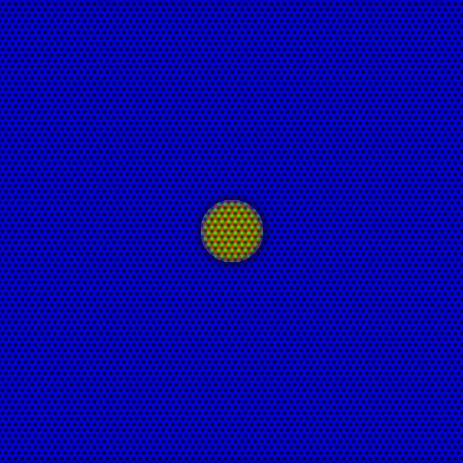

# Phase field crystal modeling of graphene hexagonal boron nitride interfaces

This repository consists of the code to study the graphene/hexagonal boron nitride in-plane heterostructure using the Phase field crystal (PFC) model. 
The code is written in MATLAB-VTK and FORTRAN. 

For more information: Shrikant S. Channe. Phase-field crystal modeling of graphene/hexagonal boron nitride interfaces. Phys. Chem. Chem. Phys., 2024,26, 13463-13479. https://doi.org/10.1039/D3CP05265F
